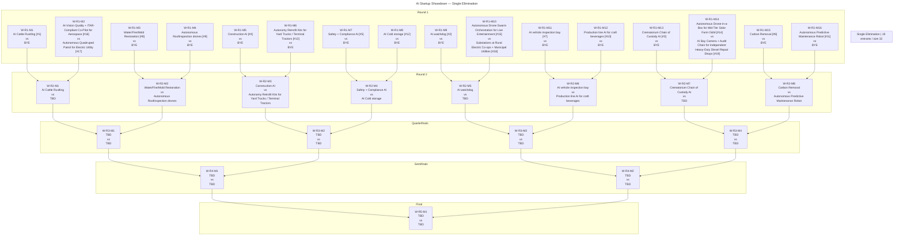

# AI Startup Showdown — Single Elimination

```mermaid
---
title: AI Startup Showdown — Single Elimination
---
flowchart TB
    subgraph meta["Single Elimination | 19 entrants / size 32"]
        direction TB
    end
    subgraph round_0["Round 1"]
        W_R1_M1["W-R1-M1<br/>AI Cattle Rustling [#1]<br/>vs<br/>BYE"]
        W_R1_M2["W-R1-M2<br/>AI-Vision Quality + ITAR-Compliant Co-Pilot for Aerospace [#16]<br/>vs<br/>Autonomous Quadruped Patrol for Electric Utility [#17]"]
        W_R1_M3["W-R1-M3<br/>Water/Fire/Mold Restoration [#8]<br/>vs<br/>BYE"]
        W_R1_M4["W-R1-M4<br/>Autonomous Roofinspection drones [#9]<br/>vs<br/>BYE"]
        W_R1_M5["W-R1-M5<br/>Construction AI [#4]<br/>vs<br/>BYE"]
        W_R1_M6["W-R1-M6<br/>Autonomy Retrofit Kits for Yard Trucks / Terminal Tractors [#13]<br/>vs<br/>BYE"]
        W_R1_M7["W-R1-M7<br/>Safety + Compliance AI [#5]<br/>vs<br/>BYE"]
        W_R1_M8["W-R1-M8<br/>AI Cold storage [#12]<br/>vs<br/>BYE"]
        W_R1_M9["W-R1-M9<br/>AI watchdog [#2]<br/>vs<br/>BYE"]
        W_R1_M10["W-R1-M10<br/>Autonomous Drone Swarm Orchestration for Live Entertainment [#15]<br/>vs<br/>Substations at Rural Electric Co-ops + Municipal Utilities [#18]"]
        W_R1_M11["W-R1-M11<br/>AI vehicle inspection bay [#7]<br/>vs<br/>BYE"]
        W_R1_M12["W-R1-M12<br/>Production line Ai for craft beverages [#10]<br/>vs<br/>BYE"]
        W_R1_M13["W-R1-M13<br/>Crematorium Chain of Custody AI [#3]<br/>vs<br/>BYE"]
        W_R1_M14["W-R1-M14<br/>Autonomous Drone-in-a-Box for Mid-Tier Solar Farm O&M [#14]<br/>vs<br/>AI Bay Camera + Audit Chain for Independent Heavy-Duty Diesel Repair Shops [#19]"]
        W_R1_M15["W-R1-M15<br/>Carbon Removal [#6]<br/>vs<br/>BYE"]
        W_R1_M16["W-R1-M16<br/>Autonomous Predictive Maintenance Robot [#11]<br/>vs<br/>BYE"]
    end
    subgraph round_1["Round 2"]
        W_R2_M1["W-R2-M1<br/>AI Cattle Rustling<br/>vs<br/>TBD"]
        W_R2_M2["W-R2-M2<br/>Water/Fire/Mold Restoration<br/>vs<br/>Autonomous Roofinspection drones"]
        W_R2_M3["W-R2-M3<br/>Construction AI<br/>vs<br/>Autonomy Retrofit Kits for Yard Trucks / Terminal Tractors"]
        W_R2_M4["W-R2-M4<br/>Safety + Compliance AI<br/>vs<br/>AI Cold storage"]
        W_R2_M5["W-R2-M5<br/>AI watchdog<br/>vs<br/>TBD"]
        W_R2_M6["W-R2-M6<br/>AI vehicle inspection bay<br/>vs<br/>Production line Ai for craft beverages"]
        W_R2_M7["W-R2-M7<br/>Crematorium Chain of Custody AI<br/>vs<br/>TBD"]
        W_R2_M8["W-R2-M8<br/>Carbon Removal<br/>vs<br/>Autonomous Predictive Maintenance Robot"]
    end
    subgraph round_2["Quarterfinals"]
        W_R3_M1["W-R3-M1<br/>TBD<br/>vs<br/>TBD"]
        W_R3_M2["W-R3-M2<br/>TBD<br/>vs<br/>TBD"]
        W_R3_M3["W-R3-M3<br/>TBD<br/>vs<br/>TBD"]
        W_R3_M4["W-R3-M4<br/>TBD<br/>vs<br/>TBD"]
    end
    subgraph round_3["Semifinals"]
        W_R4_M1["W-R4-M1<br/>TBD<br/>vs<br/>TBD"]
        W_R4_M2["W-R4-M2<br/>TBD<br/>vs<br/>TBD"]
    end
    subgraph round_4["Final"]
        W_R5_M1["W-R5-M1<br/>TBD<br/>vs<br/>TBD"]
    end
    W_R1_M1 --> W_R2_M1
    W_R1_M2 --> W_R2_M1
    W_R1_M3 --> W_R2_M2
    W_R1_M4 --> W_R2_M2
    W_R1_M5 --> W_R2_M3
    W_R1_M6 --> W_R2_M3
    W_R1_M7 --> W_R2_M4
    W_R1_M8 --> W_R2_M4
    W_R1_M9 --> W_R2_M5
    W_R1_M10 --> W_R2_M5
    W_R1_M11 --> W_R2_M6
    W_R1_M12 --> W_R2_M6
    W_R1_M13 --> W_R2_M7
    W_R1_M14 --> W_R2_M7
    W_R1_M15 --> W_R2_M8
    W_R1_M16 --> W_R2_M8
    W_R2_M1 --> W_R3_M1
    W_R2_M2 --> W_R3_M1
    W_R2_M3 --> W_R3_M2
    W_R2_M4 --> W_R3_M2
    W_R2_M5 --> W_R3_M3
    W_R2_M6 --> W_R3_M3
    W_R2_M7 --> W_R3_M4
    W_R2_M8 --> W_R3_M4
    W_R3_M1 --> W_R4_M1
    W_R3_M2 --> W_R4_M1
    W_R3_M3 --> W_R4_M2
    W_R3_M4 --> W_R4_M2
    W_R4_M1 --> W_R5_M1
    W_R4_M2 --> W_R5_M1
```
